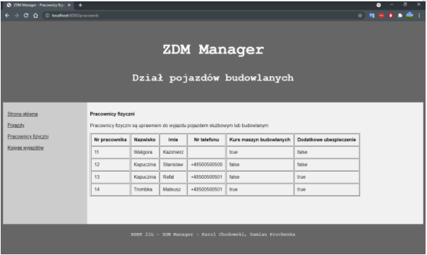

# ZDMManager
Oracle database with web management panel

## General info
Database for ZDM (municipal road administration). App gives access to tables, associated with company parking management. Security guard of parking can manage lists of vehicles, employees and history of users who used company owned vehicles.

## Technologies
Project is created with:
* Java 11
* Spring
* JDBC
* Thymeleaf
* JUnit

## Screenshots
* Main page

* Vehicles

* Add new vehicle

* Edit vehicle

* Display employees

* History of vehicles usage

* Add new entry to history

* Error page, e.g. when there is no connection with database

